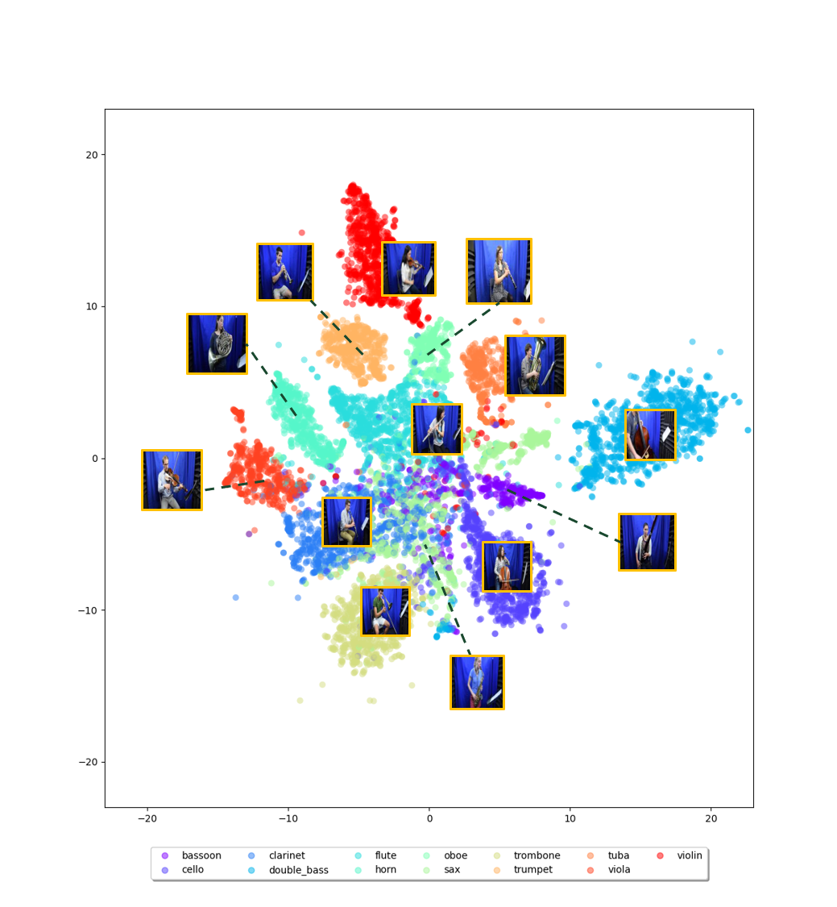

# GENERATION TO ONE ANOTHER DOMAIN: Audio ⟷ Image (Pytorch)
### 2021-fall-(GCT634/AI613)-KAIST Final Project
----------

# Abstract

In deep learning, research on the generation between the
same domains has already shown excellent performance.
However inter-domain generation research remains a challenging field, and there are still lot of studies about finding correlations between different modalities. Among
these, we propose Adversarial Conditional VAE(AC-VAE)
model which generates one modality(audio/visual) from
the other modality(visual/audio) by utilizing the advantages of two representative generation methods and simple
auxiliary classifier. In the experiments, the proposed model
shows quite good results in both audio to image and image
to audio generations. We report our results and discussion.

## Model structure: Adversarial Conditional VAE(AC-VAE):


## Results:

### Audio to Image:
#### In Result(A2I) folder, you can find more results.


### Image to Audio:
#### In Result(I2A) folder, you can find more results.


### Visualization latent space:

<p float="left">
  
   

</p>


## Usage:

First, put dataset in ```<Code_path>/dataset/```

Dataset Link: https://www.cs.rochester.edu/~cxu22/d/vagan/

The results will save in ```<Code_path>/experiment/```

### Run Audio to Image:

```
python trainA2I.py --name <save_result_name>
```
### Run Image to Audio:

```
python trainA2I.py --name <save_result_name>
```
