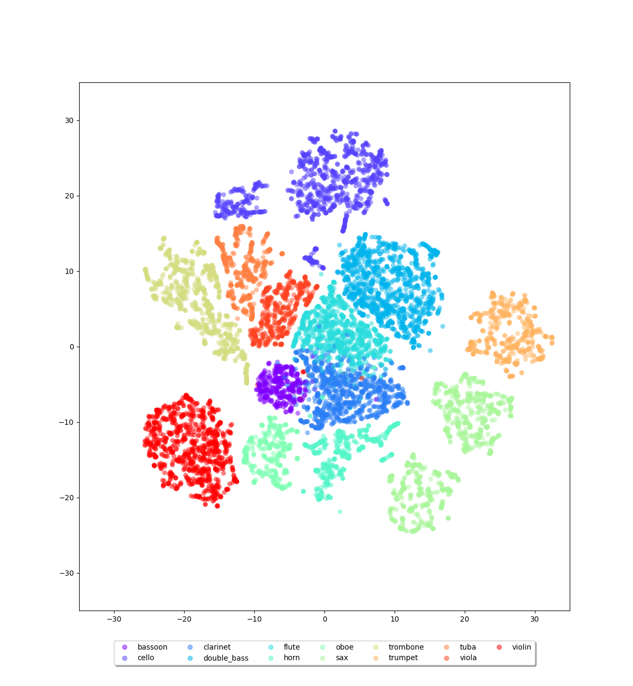

# GENERATION TO ONE ANOTHER DOMAIN: Audio ⟷ Image (Pytorch)
### GCT634-Final-Project
----------
# Model structure: Adversarial Conditional VAE(AC-VAE):


# Results:

## Audio to Image:


## Image to Audio:


## Visualization latent space:

<p float="left">
  
   

</p>


# Usage:

First, put dataset in ```<Code_path>/dataset/```

Dataset Link: https://www.cs.rochester.edu/~cxu22/d/vagan/

The results will save in ```<Code_path>/experiment/```

## Run Audio to Image:

```
python trainA2I.py --name <save_result_name>
```
## Run Image to Audio:

```
python trainA2I.py --name <save_result_name>
```

## Run Cross Modal Generation:

```
python train_CrossModal.py --name <save_result_name>
